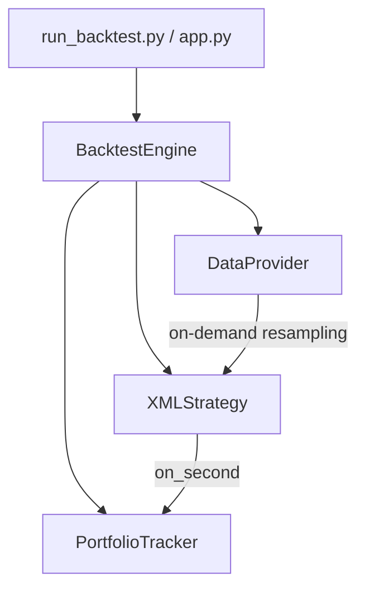

# Institutional Options & Futures Backtesting Engine

An institutional-grade, high-performance, modular, and strategy-agnostic backtesting engine built to simulate options strategies using 1-second resampled options and futures data.

The engine uses a **lazy-loading, caching data provider** that resamples ticks on-demand to achieve sub-second simulation speeds (processing a full trading day in ~0.7 seconds), executing tens of thousands of trades across months of data seamlessly.

---

## 🏗️ Architecture & Modular Design

The codebase follows strict SOLID principles to decouple strategy logic, portfolio accounting, data retrieval, and evaluation metrics:



1. **`DataProvider`** ([data_provider.py](file:///home/vivek/test/gitrepo/backtest/backtest_engine/data_provider.py)): Scans available folders, extracts expiries/strikes, loads raw CSV data, resamples to a 1-second grid (`09:15:00` to `15:30:00`), forward-fills missing ticks, and caches active instruments in RAM.
2. **`PortfolioTracker`** ([portfolio.py](file:///home/vivek/test/gitrepo/backtest/backtest_engine/portfolio.py)): Tracks cash, active positions, average entry prices, order executions, commissions/slippage adjustments, and trade logs.
3. **`XMLStrategy`** ([strategy.py](file:///home/vivek/test/gitrepo/backtest/backtest_engine/strategy.py)): Decouples strategy logic from python code. It parses XML strategy specifications, allowing users to define trading universes, entry/exit criteria, and sizing without writing Python code.
4. **`BacktestEngine`** ([core.py](file:///home/vivek/test/gitrepo/backtest/backtest_engine/core.py)): Drives the chronological simulation loop over multiple days, manages the daily strategy lifecycle, and compiles performance metrics.

---

## 📁 Directory Structure

```text
.
├── app.py                     # Streamlit Dashboard UI
├── run_backtest.py            # CLI Runner script
├── backtest_engine/           # Core library package
│   ├── __init__.py
│   ├── core.py                # Main simulation engine
│   ├── data_provider.py       # Data parsing, resampling & caching
│   ├── portfolio.py           # Portfolio valuation & trade accounting
│   └── strategy.py            # Base strategy interface & XML parser
├── configs/
│   └── backtest_config.yaml   # YAML Simulation settings (capital, fees, dates)
├── strategies/
│   └── atm_straddle_strategy.xml # XML Strategy rules definition
├── data/                      # Intraday options & futures directories
├── output/                    # Backtest CSV & image artifacts
├── README.md                  # Main manual (this file)
└── STRATEGY_GUIDE.md          # Guide to writing new XML/YAML strategies
```

---

## 🚀 Getting Started

### 1. Environment Setup
Install the required package dependencies:
```bash
pip install -r requirements.txt
```

### 2. Running a Backtest via CLI
Run the backtest using the configuration defined in `configs/backtest_config.yaml`:
```bash
python run_backtest.py
```
To run with a custom configuration:
```bash
python run_backtest.py --config configs/backtest_config.yaml
```

The CLI runner outputs full statistics (Net PnL, Return %, Sharpe, Max Drawdown, Win Rate, brokerage costs) and saves performance plots inside `output/backtest_performance.png`.

### 3. Launching the Streamlit Dashboard
The suite includes an interactive web dashboard to monitor results, inspect trades, look at strategy configs, and run new simulations directly from the browser:
```bash
streamlit run app.py
```
Once launched, open **[http://localhost:8501](http://localhost:8501)** in your web browser.

---

## 📈 Performance Summary: ATM Options Straddle
Below are the results for the default strategy (**ATM Straddle** on NIFTY and BANKNIFTY with closest expiry and 1-second rebalancing) ran over the full month of November 2022:

- **Initial Capital**: `1,000,000.00 INR`
- **Net PnL**: `-5,605.68 INR (-0.56%)`
- **Max Drawdown**: `-0.56%`
- **Total Orders Executed**: `32,704` (Whipsaw due to high frequency ATM selection)
- **Total Fees Paid**: `986.87 INR`
- **Win Rate (Sells)**: `39.68%`
- **Execution Time**: `~14.9 seconds` for the entire 21-day month.

Check [STRATEGY_GUIDE.md](file:///home/vivek/test/gitrepo/backtest/STRATEGY_GUIDE.md) to learn how to refine this strategy or construct new ones.